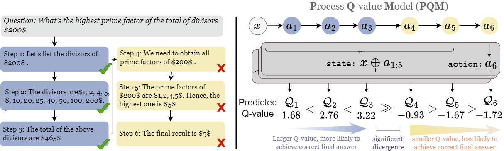

<div align="center">

# Process Reward Model with Q-value Rankings

</div>


## Introduction
<div align="center">

</div>

We present a new framework for PRM by framing it as a $Q$-value ranking problem, providing a theoretical basis for reward modeling that captures inter-dependencies among reasoning states.
We also show that prior classification-based PRM can be cast as a special case under our framework.
We validate its effectiveness through comprehensive experiments and ablation studies on a wide range of sampling policies, LLM backbones, and different test sets. 

## Loss Function

If you would like to deploy PQM loss to your codes, you can directly use the following loss function:

```
def PQM_loss(rewards,labels,zeta=4):
    '''
    Args:
        rewards: (batch_size, padded_step_number)
        labels: (batch_size, padded_step_number), 1-0 represents correctness-incorrectness, -100 is padding_token_id
        zeta: float

    Returns:
        loss: float

    '''
    has_neg = (labels==0).sum(-1).bool()
    pos_rewards_exp = torch.where(labels == 1, (rewards).exp(), 0)
    neg_rewards_exp = torch.where(labels == 0, (rewards+zeta).exp(), 0).flip(dims=[-1])
    neg_reward_sum = neg_rewards_exp.sum(-1)

    pos_rewards_ = torch.where(labels == 1, (rewards).exp(), 0)
    pos_rewards_cumsum = torch.cat(
        [torch.zeros(rewards.shape[0], 1, device=rewards.device), pos_rewards_.cumsum(-1)[:, 1:]], dim=1)

    reward_exp_cur = torch.where(labels == 1, pos_rewards_exp, 1)
    reward_exp_cur = torch.cat([torch.zeros(rewards.shape[0], 1, device=rewards.device).exp(), reward_exp_cur],
                               dim=-1)
    pos_rewards_cumsum = torch.cat([torch.zeros(rewards.shape[0], 1, device=rewards.device),
                                    pos_rewards_cumsum + torch.zeros(rewards.shape[0], 1,
                                                                     device=rewards.device).exp()], dim=-1)
    loss = -torch.log(reward_exp_cur / (reward_exp_cur + pos_rewards_cumsum + neg_reward_sum[..., None] + 1e-5))
    labels = torch.cat([has_neg[...,None], labels], dim=-1)
    loss = (torch.where(labels == 1, loss, 0).sum(-1) / torch.where(labels == 1, 1, 0).sum(-1)).mean()
    return loss
```

## Reproduction

### Train
#### Main Experiments
To reproduce experimental results of main experiments, please run

```
python -m torch.distributed.run --nnodes=1 --nproc_per_node=8 trian_main.py
```

There are some arguments you could use,

```
--model-path <path of LLM backbone>
--dataset-path <path of the Math-Shepherd corpus>
--save-path <path to save checkpoints>
--loss-type <select from [rank,orm,mse,bce]>
--zeta <hyperparameter of our loss as in Eq.10 of our paper>
```

The choice [rank,orm,mse,bce] of loss-type refers to our comparative loss of PQM, outcome reward model (ORM), MSE loss and BCE loss. 

#### Ablation Experiments

To reproduce experimental results of main experiments, please run

```
python -m torch.distributed.run --nnodes=1 --nproc_per_node=8 train_ablation.py
```

There are some arguments you could use,

```
--model-path <path of LLM backbone>
--dataset-path <path of the Math-Shepherd corpus>
--save-path <path to save checkpoints>
--loss-type <select from [rank,theory-rank,ablate-rank]>
--zeta <hyperparameter of our loss as in Eq.10 of our paper>
```

The choice [rank,theory-rank,ablate-rank] of loss-type refers to the practical version as in Eq.10, the theoretical version as in Eq.9, the ablate version as in Eq.12.


### Evaluation

To obtain the Best-of-N results of PQM, please run

```
CUDA_VISIBLE_DEVICES=2,3 nohup deepspeed bon_eval_hf.py 
```

There are some arguments you could use

```
--backbone-path <the path of a LLM backbone to train your PQM>
--model-path <the checkpoint to be evaluated>
--data-name <select from [math,gsm8k], corresponding to MATH500 and GSM-Plus>
--data-file <the file of trajectories sampled by policy models>
--combine <1 when incorporating self-consistency, otherwise 0>
--baseline <1 when obtaining self-consistency and pass@k, otherwise 0>
--save-file <path to save your evaluation results>
```

### Checkpoints & Evaluation Data

We release the sampling corpus of three policies and PQM checkpoints on 🤗[huggingface](https://huggingface.co/Windy0822/PQM/)


## Citation
```
@misc{li2024processrewardmodelqvalue,
      title={Process Reward Model with Q-Value Rankings}, 
      author={Wendi Li and Yixuan Li},
      year={2024},
      eprint={2410.11287},
      archivePrefix={arXiv},
      primaryClass={cs.CL},
      url={https://arxiv.org/abs/2410.11287}, 
}
```
